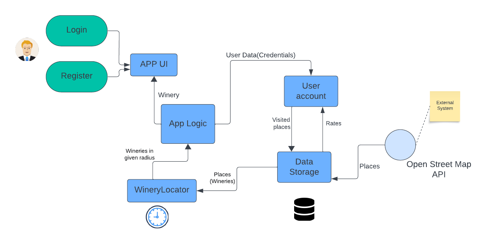
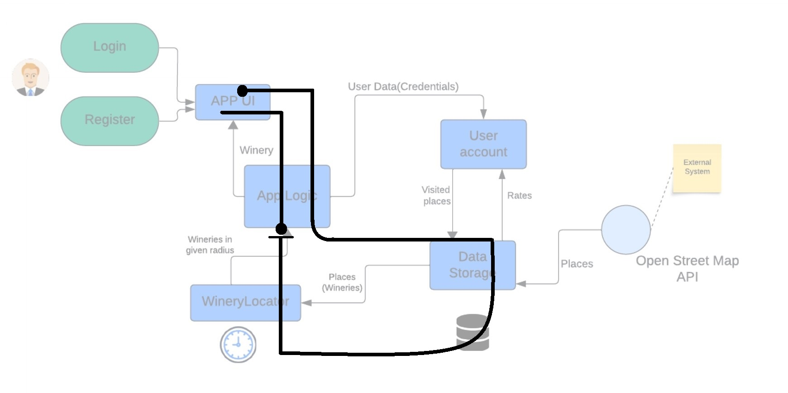
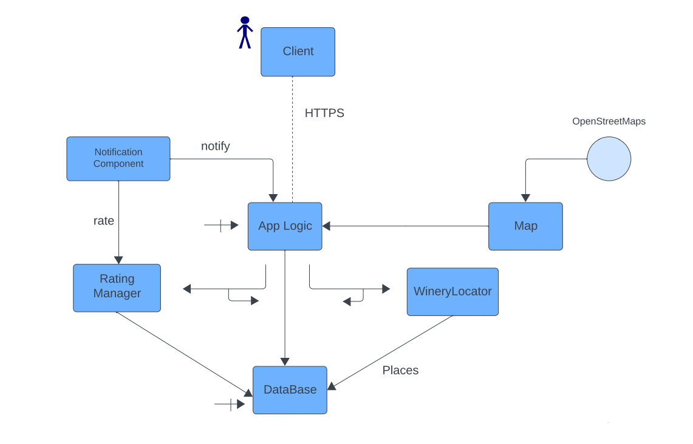

# Проект по Дизајн и Архитектура на Софтвер

### Име на веб апликација: "WineWithMe"
##	1.1 Вовед
Во овој текст ќе ви ја претставиме нашата апликација која има за цел да ги поврзе љубителите на виното со винариите во Македонија. Апликацијата овозможува корисниците да ги најдат, пребаруваат, филтрираат, оценуваат и коментираат винариите во нивната близина или во други градови.Апликацијата е развиена со користење на различни технологии и архитектурни принципи, кои ќе ги објасниме во продолжение. Текстот е поделен на четири дела: концептуална архитектура, извршна архитектура, имплементациска архитектура и use case мапа. Во секој дел ќе ги опишеме главните компоненти, функционалности и врски на апликацијата.
## 1.2 Концептуална архитектура

1.	Регистрација и Најава: 
      Корисниците можат да се регистрираат со нивните податоци.
      Веќе регистрираните корисници можат да се најават на своите профили.
2.	Преглед на Винарии: 
      Апликацијата обезбедува преглед на локациите на винариите во Македонија.
3.	Филтрирање на Винарии: 
      Корисниците можат да филтрираат винарии според име или град.
4. Информации за Винарии: 
   Прикажување на работното време и контакт информации за избраната винарија.
5. Оценување на Винарии: 
   Корисниците имаат можност да оставуваат оцени и коментари за посетените винарии.
6. Управување со Оцени: 
   Возможност за корисниците да бришат свои поставени оцени.
7. Мулти-јазичност: 
   Апликацијата ја прикажува информацијата и на македонски и на англиски јазик.
8. Точност на Локации: 
   Прикажување на локациите на винариите со висока точност од 99%.
9. Пристап преку Веб Прелистувач: 
   Возможност за пристап до апликацијата преку било кој веб прелистувач.
10. Брз Приказ на Информации: 
    Обезбедува брз приказ на информации за винариите.
11. Лесно Снаоѓање: 
    Апликацијата има едноставен интерфејс што го олеснува корисниците во нивното снаоѓање.
     
     
  

  

 
App UI: 
-Презентациски слој 
-Менаџирање на output-от 
-HTTPS конекција со AppLogic 
-Рендерирање на мапа.

AppLogic: 
-Пресметување на координати 
-Наоѓање на објекти даден радиус 
-Конекција со база 
-Автентикација на корисниците 

DataStorage: 
-Податоци за името, адресата, типот на кафетеријата заедно со координатите . 
-Податоци за најава 
-Оценки за кафетеријата 

UserAccount: 
-Менаџирање со податоците на корисникот. 
-Дел од AppLogic. 

OpenStreetMaps: 
Надворешен систем од кој ги преземавме податоците за објектите како и мапата на UI. 

WineryLocator: 
-Наоѓање на објекти во даден радиус . 
-Трансформација на податоци ако е потребно 
 
Use Case: 
Милена и Петар, двајцата винарски ентузијасти од Скопје, се одлучиле да ги искусат вината во Македонија. За да го направат тоа подобро, решиле да го искористат потенцијалот на апликацијата "Wine With Me".
 Додека се на еден од прекрасните викенд патувања, тие отвориле апликацијата и веднаш добиле преглед на блиските винарии. Го филтрирале пребарувањето според градот каде што се наоѓале, и нашле неколку винарии во околината.Ги проучиле рецензиите и оценките од други корисници за секоја винарија.Со помош на апликацијата тие лесно нашле пат до одбраната винарија.
 При пристигнувањето, Милена и Петар уживале во изобилството на вина и пријатната атмосфера. Со задоволство го ставиле своето искуство и рејтинг во апликацијата, со детален коментар за винаријата која ја посетиле.
  

  

## 1.3 Извршна архитектура  

  

  
Client: 
-Апликациски интерфејс кој се презентира на клиентот 
-Client sender и handler за requests.  
Notification component: 
-Ќе го извести системот кога ќе има внес на нова оценка за објектот.  
RatingManager: 
-Оваа компонента е поврзана со AppLogic преку CallBack врска. 
-Внес на оценка 
-CRUD фунцкионалности. 
Слика 1.2. Извршна архитектура на Findify  
AppLogic: 
-Скоро сите функционалности 
-Автентикација 
-Трансформирање на податоци 
-Пресметка на радиус 
-Пресметка на објекти во близина 
-Синхрона врска со базата 
-Функција како MVC контролер  
Map: 
-Интерактивна мапа превземена од OpenStreetMap. 
-Сервис на апликацијата. 
DataBase: 
-Податоци за името, адресата, типот на кафетеријата заедно со координатите .
 -Податоци за најава 
-Оценки за кафетеријата 
-CRUD фунцкионалности   

